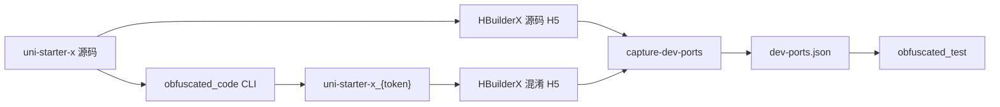

# uniapp-code

UniApp-X 源码混淆工具与 **H5 自动化对比验证** 工作区。**CSS/JS（`--mode code`）L1–L4 全层混淆** 已通过 Playwright 对比验证（路由冒烟、交互爬链与 loading 样式）；**`--mode clone`** 路径混淆测试尚未通过。

## 测试状态

| 测试项 | 说明 | 状态 |
|--------|------|------|
| CSS / JS（`--mode code`） | L1–L4 全层混淆 + H5 对比（路由 / loading） | ✅ 已通过 |
| Clone（`--mode clone`） | 路径 clone + 静态资源 hash | ❌ 未通过 |

## 本仓库包含什么

Git 跟踪的是**测试与文档**；混淆器源码和业务项目保留在本地，体积大、各自有独立 Git 历史。

| 路径 | Git | 说明 |
|------|-----|------|
| [`obfuscated_test/`](obfuscated_test/) | ✅ | Playwright 对比测试（路由 + loading + 截图画廊） |
| [`docs/`](docs/) | ✅ | 流程与方案文档 |
| [`obfuscated_code/`](obfuscated_code/) | ❌ | **uniapp-x-obfuscator** CLI 源码（本地 clone，见 `.gitignore`） |
| `uni-starter-x/` | ❌ | 业务源码项目（本地） |
| `uni-starter-x_{token}/` | ❌ | 混淆产物（`seed-stable` 固定目录，本地生成） |

## 架构



## 目录结构

```
uniapp-code/
├── obfuscated_test/          # Playwright 对比测试（本仓库主代码）
│   ├── scripts/              # route-test、loading-style-test、dev-ports
│   ├── config/               # defaults / dev-ports 示例与本地配置
│   ├── reports/              # 对比报告（gitignore，运行后生成）
│   └── screenshots/          # 截图与并排画廊（gitignore）
├── docs/
│   └── L1-L4-混淆测试流程.plan.md
├── obfuscated_code/          # 混淆器（本地，gitignore）
└── uni-starter-x*/           # 源码与产物（本地，gitignore）
```

## 前置条件

- Node.js ≥ 18
- HBuilderX ≥ 4.45（uni-app-x Web 调试）
- 业务项目已切换到 **u 端**：`cd uni-starter-x && npm run app:u`

## 端到端流程

### 1. 构建混淆器

```bash
cd obfuscated_code
npm install && npm run build
```

CLI 详细说明见 [`obfuscated_code/README.md`](obfuscated_code/README.md) 与 [`obfuscated_code/COMMAND.md`](obfuscated_code/COMMAND.md)。

### 2. 运行 L1–L4 混淆

配置：`uni-starter-x/obfuscated/obfuscator.config.layer1234.json`（L1–L4 全开，`seed-stable`）。

```bash
cd obfuscated_code
node dist/cli.js run ../uni-starter-x \
  --mode code \
  --config ../uni-starter-x/obfuscated/obfuscator.config.layer1234.json \
  --verbose
```

产物目录固定为 `uni-starter-x_{token}/`（`seed: layer1234` → `uni-starter-x_yPhMVaVR6HcrZm1R`）。  
仅排查 L1 时可用 `obfuscator.config.layer1.json`。

**L1–L4 能力一览**

| 层级 | 主要 feature |
|------|----------------|
| L1 | 去注释、字符串加密、标识符/属性/枚举重命名 |
| L2 | 垃圾函数/属性、UI 增强 junk |
| L3 | 函数乱序、执行顺序打乱、控制流平坦化 |
| L4 | 新 junk 模板、`renameProtocol` |

诊断日志与映射写入源项目 `uni-starter-x/obfuscated/config/`，不污染产物目录。

### 3. 启动双端 H5

端口由 Vite **自动分配**（5173 起递增），不要写死。

```bash
# 源码
cd uni-starter-x && npm run app:u
/Applications/HBuilderX.app/Contents/MacOS/cli launch web \
  --project /path/to/uni-starter-x

# 混淆产物（替换为实际 token 目录）
cd uni-starter-x_yPhMVaVR6HcrZm1R && npm run app:u
/Applications/HBuilderX.app/Contents/MacOS/cli launch web \
  --project /path/to/uni-starter-x_yPhMVaVR6HcrZm1R
```

### 4. 捕获端口并运行对比

```bash
cd obfuscated_test
npm install
npx playwright install chromium

cp config/defaults.example.json config/defaults.json   # 首次
npm run capture:dev-ports                                # 双端 H5 就绪后

npm run test:compare          # 路由冒烟 + 爬链 + 截图 + diff（有头，需分别登录）
npm run test:loading:compare  # order / service-list loading 样式对比
```

端口也可手动指定：

```bash
node scripts/capture-dev-ports.mjs \
  --source-url http://localhost:5174 \
  --obfuscated-url http://localhost:5173
```

### 5. 查看结果

| 产出 | 路径 |
|------|------|
| 并排截图画廊 | `obfuscated_test/screenshots/index.html` |
| 路由对比报告 | `obfuscated_test/reports/route-compare.md` |
| Loading 样式报告 | `obfuscated_test/reports/loading-style-test.md` |

完整步骤与端口策略见 [`docs/L1-L4-混淆测试流程.plan.md`](docs/L1-L4-混淆测试流程.plan.md)。  
测试脚本说明见 [`obfuscated_test/README.md`](obfuscated_test/README.md)。

## 混淆器命令速查

> 子命令均需 `--mode clone | code | full`；配置文件默认 `full`，测试时请显式传入。

| 命令 | 作用 |
|------|------|
| `run --mode code` | 代码混淆 + uvue/css 资源变换（**uni-starter-x 主流程，L1–L4 已验证**） |
| `run --mode clone` | 路径 clone + 静态资源 hash（**测试未通过**） |
| `run --mode full` | 路径 + 静态 + 代码 + 资源（默认） |
| `preload --mode <mode>` | 预分析（vocab / symbols / paths 等） |
| `check / fix` | 产物自查与修复（`--mode` 须与 run 一致） |
| `init [项目]` | 生成 `{项目}/obfuscated/obfuscator.config.json` |

常用 run 参数：`--config`、`--seed`、`--preset light|medium`、`--no-seed`（空 seed）、`--verbose`。

## 验证要点

- **路由可达性**：源码与混淆端 smoke 路由状态一致（Playwright Tab 点击导航，非直链 goto）
- **Loading 样式**：`order`、`service-list` 页 loading overlay 与 flex dots 布局正常
- **Header 高度**：`ux-header` 内联 `style["height"]` 不被 CSS class 重命名误伤（L4 字符串加密保留 key）
- **登录**：compare 模式两端 localStorage 独立，有头模式下分别登录；CI 可用 `--no-prompt-login`

## 开发与回归

```bash
# 混淆器单元测试
cd obfuscated_code && npm test

# 仅冒烟 / 仅爬链
cd obfuscated_test
npm run test:smoke
npm run test:crawl
```

## 相关文档

- [L1-L4 混淆测试流程](docs/L1-L4-混淆测试流程.plan.md)
- [obfuscated_test 使用说明](obfuscated_test/README.md)
- [混淆器 README](obfuscated_code/README.md)（本地）
- [混淆器 COMMAND 参考](obfuscated_code/COMMAND.md)（本地）
