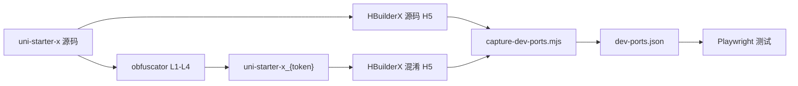

# L1-L4 混淆 + 动态端口测试流程

## 端口策略

HBuilderX / Vite **不能固定 5173/5174**。实际行为：

- 默认从 5173 起，**已被占用则自动 +1**（日志：`Port 5173 is in use, trying another one...`）
- 谁先启动、本机其它 dev 进程都会影响最终端口
- **启动命令里不应写死端口号**

因此：**固定的是项目目录，不是端口**；端口在每次启动后捕获并写入配置文件。

| 角色 | 固定项 | 动态项 |
|------|--------|--------|
| 源码 | 项目 [uni-starter-x](uni-starter-x) | `http://localhost:{port}` |
| 最新混淆 | 目录 `uni-starter-x_{token}`（seed=layer1234） | `http://localhost:{port}` |

## 目标架构



**登录**：沿用 [route-test.mjs](obfuscated_test/scripts/route-test.mjs) 现有逻辑（有头模式浏览器内手动登录，或 `defaults.json` 账号自动填表）。**不做 u_token 预注入。**

---

## 1. 新增 L1-L4 全层配置

新建 [obfuscator.config.layer1234.json](uni-starter-x/obfuscated/obfuscator.config.layer1234.json)（在 layer1 基础上叠加 L2-L4），核心：

```json
{
  "seed": "layer1234",
  "outputDirNaming": "seed-stable",
  "mode": "code"
}
```

保留 [obfuscator.config.layer1.json](uni-starter-x/obfuscated/obfuscator.config.layer1.json) 仅用于 L1 单独排查。

---

## 2. 混淆命令（单一最新产物）

```bash
cd obfuscated_code && npm run build
node dist/cli.js run ../uni-starter-x \
  --mode code \
  --config ../uni-starter-x/obfuscated/obfuscator.config.layer1234.json \
  --verbose
```

确认日志：`目标目录: .../uni-starter-x_{token}`（每次覆盖同一目录）。

---

## 3. 双端 H5 启动（不写端口）

**源码：**

```bash
cd /Users/malongguo/ai/uniapp-code/uni-starter-x
npm run app:u
/Applications/HBuilderX.app/Contents/MacOS/cli launch web \
  --project /Users/malongguo/ai/uniapp-code/uni-starter-x
```

**混淆（固定产物目录）：**

```bash
cd /Users/malongguo/ai/uniapp-code/uni-starter-x_{token}
npm run app:u
/Applications/HBuilderX.app/Contents/MacOS/cli launch web \
  --project /Users/malongguo/ai/uniapp-code/uni-starter-x_{token}
```

启动后在 HBuilderX 控制台查看实际地址，例如：

```text
Local: http://localhost:5174/
```

两端都 ready 后，运行端口捕获：

```bash
cd obfuscated_test
node scripts/capture-dev-ports.mjs
```

---

## 4. dev-ports.json（端口注册表）

新建 `obfuscated_test/config/dev-ports.json`（**gitignore**，本地每次启动后更新）：

```json
{
  "source": {
    "project": "/Users/malongguo/ai/uniapp-code/uni-starter-x",
    "base": "http://localhost:5174"
  },
  "obfuscated": {
    "project": "/Users/malongguo/ai/uniapp-code/uni-starter-x_{token}",
    "base": "http://localhost:5173"
  },
  "updatedAt": "2026-06-08T..."
}
```

### capture-dev-ports.mjs 逻辑

1. 扫描 `5173–5185` 监听端口（`lsof` 或 HTTP probe）
2. 对候选 URL 发请求，结合进程 cwd / 项目路径匹配源码 vs 混淆目录
3. 匹配失败时：交互式让用户粘贴 HBuilderX 控制台里的 `Local:` URL
4. 写入 `dev-ports.json` 并打印摘要

### 测试脚本读取优先级

```
CLI --base-a / --base-b  >  dev-ports.json  >  defaults.json（仅作 fallback，可留空）
```

[defaults.json](obfuscated_test/config/defaults.json) **不再硬编码 5173/5174**，以 `dev-ports.json` 为准。

---

## 5. 测试命令（自动读 dev-ports.json + 对比截图）

对比测试**必须产出截图**，用于肉眼 diff。现有 [route-test.mjs](obfuscated_test/scripts/route-test.mjs) 已支持，计划阶段确保与 `dev-ports.json` 联动后行为不变。

### 5.1 路由对比（主流程）

```bash
cd obfuscated_test

# 捕获端口（双端 H5 启动后执行一次）
node scripts/capture-dev-ports.mjs

# 完整对比：冒烟 + 爬链 + 截图 + diff 报告（有头，浏览器内分别登录）
npm run test:compare
# 等价于 node scripts/route-test.mjs --compare --headed
```

**截图产出**（每次 compare 后检查）：

| 路径 | 说明 |
|------|------|
| `screenshots/source/` | 源码端各路由截图 |
| `screenshots/obfuscated/` | 混淆端各路由截图 |
| `screenshots/index.html` | **并排对比画廊**（同名路由左右对照） |
| `reports/route-compare.md` | Markdown diff，含画廊链接 |
| `reports/route-compare.json` | 结构化结果 |

每条可达路由会截 `page_{route}.png`；Tab 切换、起点页另有 `00_start_*`、`tab_*` 等辅助图。

compare 模式下两端 localStorage 不共享，需在**各自浏览器窗口**完成登录后再开始探索与截图。

### 5.2 Loading 专项对比（可选）

```bash
npm run test:loading:compare
```

产出：`screenshots/loading-test/source|obfuscated/` + `reports/loading-style-test.md`。

### 5.3 实现阶段注意

- `route-test.mjs` / `loading-style-test.mjs` 读 `dev-ports.json` 时，**不关闭**现有 `--compare` 截图逻辑
- README 更新：强调 compare **必看** `screenshots/index.html`
- 可选：`--gallery-all` 将未 diff 的路由也纳入画廊（已有 CLI 参数）

---

## 6. 日常迭代顺序

1. 跑 layer1234 混淆 → 覆盖 `uni-starter-x_{token}`
2. HBuilderX 重启混淆端（源码端通常可不动）
3. `node scripts/capture-dev-ports.mjs` 更新端口
4. Playwright compare → 打开 `screenshots/index.html` 查看并排截图

---

## 需改动的文件（实现阶段）

| 文件 | 改动 |
|------|------|
| `uni-starter-x/obfuscated/obfuscator.config.layer1234.json` | 新建 L1-L4 全层配置 |
| `obfuscated_test/config/dev-ports.example.json` | 示例结构 |
| `obfuscated_test/config/dev-ports.json` | 本地端口（gitignore） |
| `obfuscated_test/scripts/capture-dev-ports.mjs` | **新建** 端口捕获 |
| `obfuscated_test/scripts/route-test.mjs` | 读 dev-ports + auto base；**保留 compare 截图与 index.html 画廊** |
| `obfuscated_test/scripts/loading-style-test.mjs` | 读 dev-ports；保留 loading 对比截图 |
| `obfuscated_test/config/defaults.json` | 去掉硬编码端口 |
| `obfuscated_test/README.md` | 动态端口 + **对比必看 screenshots/index.html** |
