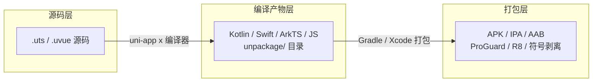
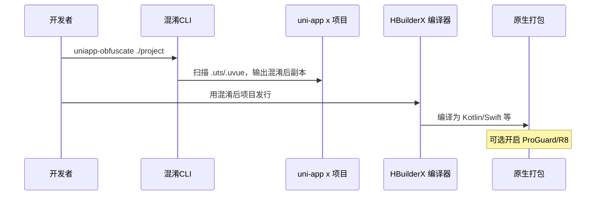
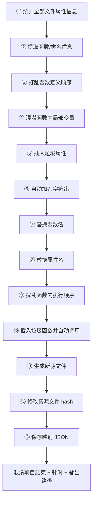
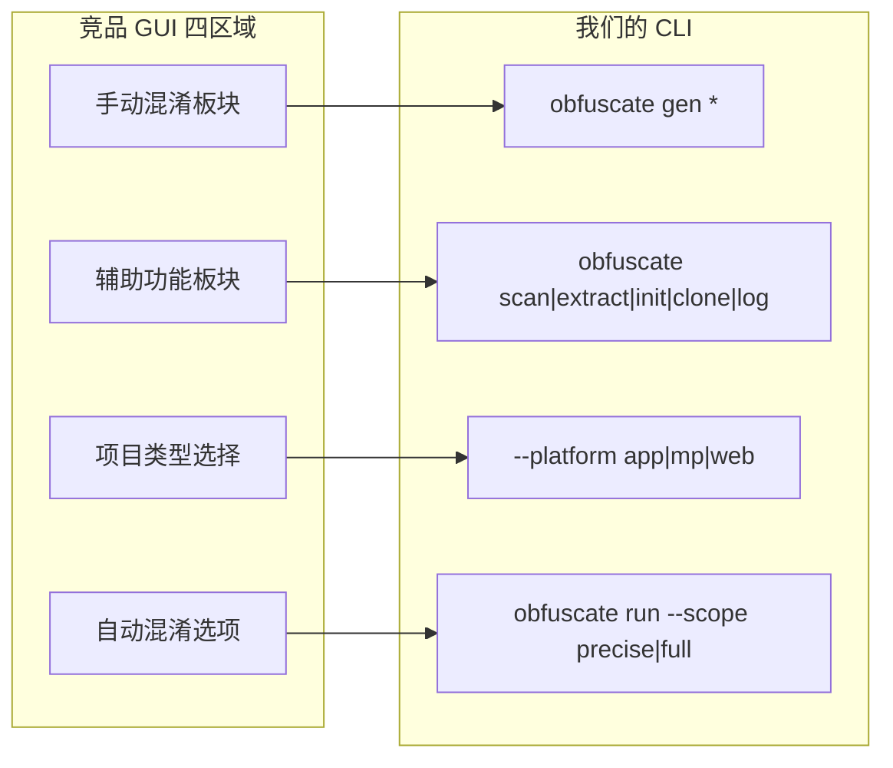
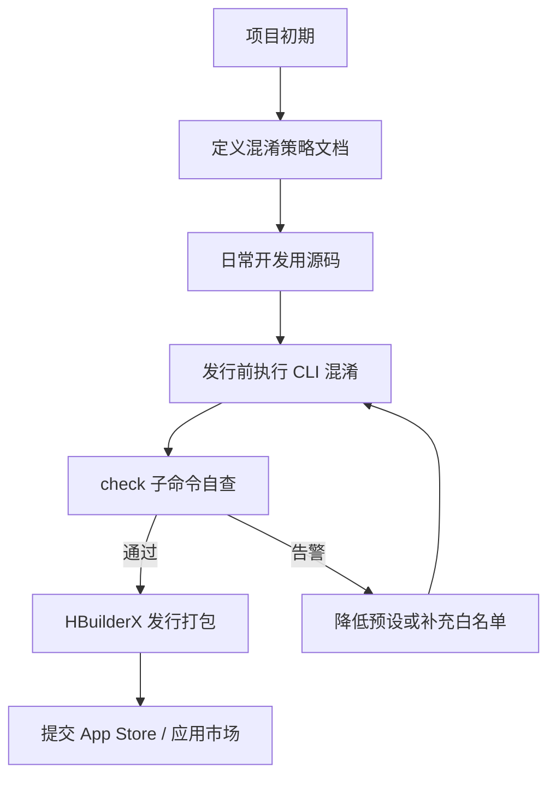

# UniApp-X 混淆软件实现计划

> **CLI 当前状态（2026-06）**：入口 `node dist/cli.js`；子命令 `run` / `init` / `check` / `fix` / `preload`（**必需 `--mode`**）。  
> `preload` 写 `{mode}-vocab.json` 等预分析产物；`run` = Preload 解析（`*-parse.json`、`*-symbols-collect.json`）+ Transform。  
> 日志与映射统一在 `{源项目}/obfuscated/config/`。速查见 [COMMAND.md](../COMMAND.md)。

## 什么是代码混淆

> 定义来源：[UniApp 打包 iOS 应用并通过审核：代码混淆的挑战与解决方案](https://developer.baidu.com/article/details/3237364)

**代码混淆**是一种通过改变代码结构、变量名、函数名等方式，使代码难以阅读和理解的技术。其目的是提高逆向工程成本，保护核心业务逻辑和敏感信息，而非让代码无法运行。

本工具将覆盖文章所述的各类混淆手段，并映射到 uni-app x 的 UTS/uvue 源码层：

| 混淆手段 | 本工具对应能力 | 阶段 |
|---------|--------------|------|
| 改变变量名、函数名 | 标识符重命名（`_0x` 短名） | MVP |
| 改变代码结构 | 控制流平坦化、死代码注入 | 二期 |
| 保护敏感信息 | 字符串加密（运行时解密） | 二期 |
| 打包层加固 | ProGuard/R8 规则模板（Android） | 二期 |

---

## 你的判断是对的：三层是传导关系，不是三选一



**源码层改了，编译产物和最终包体确实会跟着变。** 例如把 `calculatePrice()` 改成 `_0x3f2a()`，编译出的 Kotlin 里函数名也会变，最终 dex 里同样难读。

因此**不需要做三套独立混淆**，应以**源码层为主入口**，其余层按需补充。

---

## 各层实际差异（为什么不是完全重复）

| 层级 | 你能控制什么 | 源码混淆覆盖不到什么 |
|------|-------------|---------------------|
| 源码层 | 业务变量/函数名、字符串加密、控制流平坦化 | — |
| 编译产物层 | 编译器生成的胶水代码、框架暴露的符号 | 若只改源码，编译器可能还原部分命名模式 |
| 打包层 | dex 优化、无用代码删除、反射/序列化 keep 规则 | 无法混淆 `pages.json` 路由、manifest 等配置 |

**结论：**
- **MVP 只做源码层** → 已能保护大部分业务逻辑
- **打包层** → 发行时顺手开 ProGuard/R8（Android 标配，几乎零成本）
- **编译产物层** → 仅当需要「无源码、只拿到 unpackage」或「二次处理编译器输出」时才单独做

---

## 推荐技术路线：源码层混淆 CLI

在空工作区 [`/Users/malongguo/ai/uniapp-code`](/Users/malongguo/ai/uniapp-code) 新建 **Node.js + TypeScript CLI 工具**，形态如下：

```
uniapp-x-obfuscator/
├── package.json
├── src/
│   ├── cli.ts                 # 入口：uniapp-obfuscate ./my-project
│   ├── scanner/               # 扫描 .uts / .uvue / uni_modules
│   ├── parser/                # 解析 UTS/uvue script 块
│   ├── transforms/            # 混淆变换
│   │   ├── rename-identifiers.ts   # 类/函数/属性/局部变量/枚举/协议
│   │   ├── string-encryption.ts
│   │   ├── control-flow.ts         # 调用顺序扰乱、函数拆分
│   │   ├── junk-code.ts            # 垃圾函数/属性/文件生成
│   │   ├── shuffle-order.ts        # 打乱类/函数定义顺序
│   │   ├── strip-comments.ts
│   │   ├── color-obfuscate.ts      # CSS 颜色值混淆（替代 UIColor）
│   │   └── resource-hash.ts        # 资源 hash / 像素变色
│   ├── pipeline/              # 分阶段流水线编排（分析→变换→资源→输出）
│   ├── logger/                # 实时日志、耗时统计、变更明细
│   ├── worker/                # 多线程任务分发
│   ├── vocab/                 # 符号词汇提取
│   ├── whitelist/             # 保留名单（不可混淆的符号）
│   └── writer/                # 输出到 dist/ 或原地覆盖
├── obfuscator.config.json     # 用户配置
└── README.md
```

**工作流：**



---

## 竞品运行日志借鉴（执行流水线 + 日志 UX）

> 来源：竞品实际运行截图（WHC_ConfuseSoftware 混淆日志）

竞品日志揭示了一套**固定顺序的多阶段流水线**和**逐步可见的实时输出**，用户体验成熟，我们 CLI 应对齐。

### 竞品日志中的执行顺序（我们适配为 uni-app x 流水线）



**我们的四阶段流水线（合并竞品步骤，适配 UTS/uvue）：**

| 阶段 | 竞品对应步骤 | 我们的动作 |
|------|------------|-----------|
| **Analyze** | ①② 统计属性 + 提取函数名 | 扫描项目 → 构建全局符号表 → 输出统计摘要 |
| **Transform** | ③④⑤⑥⑦⑧⑨⑩ | 按固定顺序执行 AST 变换（见下方顺序表） |
| **Resource** | ⑫ | 资源 hash 翻新 + 文件名同步（二期） |
| **Output** | ⑪⑬ | 写入 `dist-obfuscated/` + 分类映射 JSON + 完成摘要 |

**Transform 阶段固定执行顺序**（顺序很重要，竞品踩过「先改名后插入导致引用断裂」的坑）：

1. 提取符号 → 2. 打乱定义顺序 → 3. 局部变量重命名 → 4. 插入垃圾属性 → 5. 字符串加密 → 6. 函数名替换 → 7. 属性名替换 → 8. 扰乱调用顺序 → 9. 插入垃圾函数并调用 → 10. 写回文件

### 竞品日志格式（我们 CLI 应对齐输出）

竞品逐步打印**可读变更明细**，示例：

```
自动检测统计全部文件的属性信息...
提取函数名称信息...
pages/index/index.uvue : 局部变量名称 count -> modity
pages/index/index.uvue : 局部变量名称 str -> can
自动加密字符串: "wuhaichao 吴海超"
自动加密字符串: "fibonacci"
函数名称 fibonacci -> uhTg
函数名称 random_int -> nv
属性名称 tableSize -> tzcyoMasDfxlv
扰乱函数里面执行顺序...
自动添加调用混淆函数到项目...
修改全部资源文件hash值...
自动保存全部原属性名称和混淆属性名称json文件...
混淆项目结束 😄
混淆项目路径: /path/to/dist-obfuscated
耗时: 2.39 秒
```

**我们 CLI 日志规范：**

| 日志级别 | 内容 | 开关 |
|---------|------|------|
| `info` | 阶段标题（`[Analyze]`、`[Transform]`...） | 默认开启 |
| `detail` | 逐文件变更：`文件 : 类型 原名 -> 新名` | `--verbose` |
| `debug` | AST 节点、跳过的符号及原因 | `--debug` |
| `summary` | 结束摘要：文件数/符号数/耗时/输出路径 | 默认开启 |

**命名风格验证：** 竞品实际产出 `uhTg`、`tzcyoMasDfxlv` 等短随机混合大小写名，印证 `namingStyle: human` 模式的价值（比 `_0x3f2a` 更像正常代码）。

### 竞品日志揭示、我们需新增的设计点

| 借鉴点 | 说明 | 阶段 |
|-------|------|------|
| **先统计后变换** | 第一轮只收集符号，第二轮才改写，避免跨文件引用断裂 | MVP |
| **分类映射 JSON** | 不只一个 map 文件，属性/函数/字符串/资源分开存 | MVP |
| `obfuscation-map-properties.json` | 原属性名 → 混淆属性名 | MVP |
| `obfuscation-map-functions.json` | 原函数名 → 混淆函数名 | MVP |
| `obfuscation-map-strings.json` | 原字符串 → 加密后形式 | 二期 |
| `obfuscation-map-resources.json` | 原资源路径 → 新路径/hash | 二期 |
| `obfuscation-log.json` | 机器可读完整日志（含时间戳、阶段耗时、`executedFeatures`） | MVP |
| **耗时统计** | 结束打印总耗时 + 各阶段耗时（竞品 2.39 秒） | MVP |
| **完成摘要** | 输出路径 + 处理文件数 + 混淆符号数 + 跳过数 | MVP |
| **中文/emoji 字符串日志** | 加密时打印原串（如 `"wuhaichao 吴海超"`），方便核对 | 二期 |
| **实时流式输出** | 大项目边处理边打印，不等到结束才输出 | MVP |

### 竞品有、uni-app x 跳过的日志项

| 竞品日志 | 跳过原因 |
|---------|---------|
| 修改 sks 资源名称 | iOS SpriteKit 游戏资源，uni-app x 无 sks |
| 插入函数定义到头文件（.h） | OC 头文件机制；UTS 用 `export`/`interface.uts` |
| `lib -> KKNews` 模块改名 | OC 静态库结构；我们用 `pages.json` 路由同步 |

### CLI 结束摘要示例（目标输出）

```
✔ 混淆项目结束
  输出路径: ./dist-obfuscated
  处理文件: 47 个 (.uts: 12, .uvue: 35)
  混淆符号: 函数 128 | 属性 86 | 局部变量 312 | 字符串 45
  跳过符号: 203 (框架 API / 白名单)
  耗时: 1.87s (Analyze 0.3s | Transform 1.2s | Output 0.37s)
  映射文件: obfuscation-map-{properties,functions}.json
```

---

## 真实样本对比分析（hs_uni-main → N1uipM8MmyCMhBqW）

> 样本路径：[`whc_clone_directory/hs_uni-main`](/Users/malongguo/ai/uniapp-code/whc_clone_directory/hs_uni-main)（原版） vs [`whc_clone_directory/N1uipM8MmyCMhBqW`](/Users/malongguo/ai/uniapp-code/whc_clone_directory/N1uipM8MmyCMhBqW)（混淆版）

### 重要发现：这个样本是「克隆+路径混淆」，不是完整代码混淆

| 维度 | 原版 | 混淆版 | 是否变化 |
|------|------|--------|---------|
| 函数名 `showPhone`、`detailList` | ✅ 存在 | ✅ 完全相同 | ❌ 未混淆 |
| 中文 UI 文案「施工状态」 | ✅ | ✅ 完全相同 | ❌ 未混淆 |
| API 端点 `/jmy/call/info` | ✅ | ✅ 完全相同 | ❌ 未混淆 |
| 注释 | ✅ | ✅ 保留 | ❌ 未清理 |
| 垃圾代码注入 | 无 | 无 | ❌ 未注入 |
| **目录名** `login` → `N1uipM8MmyCMhBqWlogin` | — | ✅ | ✅ 已混淆 |
| **路由路径** `pages/login/register` | — | `pages/N1uipM8MmyCMhBqWlogin/register` | ✅ 已同步 |
| **静态资源路径** `static/images/` | — | `static/N1uipM8MmyCMhBqWimages/` | ✅ 已同步 |
| **import 路径** `./store` | — | `./N1uipM8MmyCMhBqWstore` | ✅ 已同步 |

结论：WHC 的「克隆」功能和「混淆」功能是**分开的两步**。这个样本只执行了克隆（目录/token 前缀化 + 全局路径替换），**没有**执行运行日志里展示的那些代码级混淆（函数改名、字符串加密、垃圾代码等）。我们的工具需要**两者都支持**，且默认应包含代码级混淆。

### 样本中的目录/token 命名规则（可借鉴）

混淆版使用 **20 字符随机 token** `N1uipM8MmyCMhBqW` 作为全局前缀：

```
login          → N1uipM8MmyCMhBqWlogin          （目录前缀化）
craftsmanEnd   → N1uipM8MmyCMhBqWcraftsmanEnd
details        → N1uipM8MmyCMhBqWdetails
register_success → N1uipM8MmyCMhBqW_success     （下划线目录：token + 保留后缀）
store          → N1uipM8MmyCMhBqWstore
static/images  → static/N1uipM8MmyCMhBqWimages/N1uipM8MmyCMhBqWtabbar/
```

**规则总结（写入我们的路径混淆模块）：**

| 规则 | 示例 | 我们的实现 |
|------|------|-----------|
| 目录加 token 前缀 | `login` → `{token}login` | `pathPrefix` 配置项，默认随机 16-20 字符 |
| 下划线目录特殊处理 | `register_success` → `{token}_success` | 检测 `_` 前缀，保留后半段 |
| `.vue`/`.js` 文件名通常不变 | `register.vue` 仍叫 `register.vue` | 二期文件名混淆为可选，默认只改目录 |
| 随机 token 每项目唯一 | `N1uipM8MmyCMhBqW` | `--seed` 或自动生成，写入 `{源项目}/obfuscated/config/clone-log.txt` |

### 白名单模式（样本中未改名的目录）

样本保留了以下目录/文件不混淆，我们应对齐为内置白名单：

| 类别 | 样本中保留原名 | 我们的白名单 |
|------|-------------|------------|
| Tab 核心页 | `guide`, `category`, `cart`, `find` | `pages.json` tabBar 关联页 |
| 根级页面文件 | `guide.vue`, `category.vue`, `cart.vue`, `user.vue` | 检测「根级 .vue + 同名子目录」冲突 |
| 组件目录 | `components/` 下全部 55 个文件夹 | `components/` 整体可选保留 |
| 部分 uni_modules | `vk-uview-ui`, `uni-icons`, `uni-popup` 等 | `uni_modules/uni-*` 官方插件 |
| 配置文件 | `common/config/`, `wanlshop_function.js` | `common/config`, `manifest.json`, `pages.json` 键名 |
| 静态根文件 | `customicons.css`, `customicons.ttf` | `static/` 根级公共资源 |

### 路径同步范围（样本做到了什么）

样本在以下位置做了全局字符串替换（**我们必须全覆盖**）：

1. **`pages.json`** — 128 处路由 path + tabBar pagePath + subPackages root
2. **`manifest.json`** — **仅** icons / splashScreens 等**图片路径**（如 `package/icon144.png`、`static/images/…`），与目录映射 + static/ 图片重命名映射合并，在 **clone 统一内容替换**时同步；不改 appid、bundleName、权限文案等
3. **`main.js`** — import 路径 `./store` → `./N1uipM8MmyCMhBqWstore`
4. **`.vue` 模板** — `static/` 图片路径、`$wanlshop.to('/pages/...')` 跳转
5. **`App.vue`** — `@import 'static/style/colorui.css'` 样式引用
6. **`uni_modules/`** — 部分包名 + 包内子目录（`utssdk/app-android` 等）

**实际 diff 示例（details.vue）：**

```vue
<!-- 原版 -->
<image src="../../../static/newImg/d.png" />
<view @tap="$wanlshop.to(`/pages/user/evaluate/evaluate?id=...`)">

<!-- 混淆版：仅路径变，逻辑不变 -->
<image src="../../../static/N1uipM8MmyCMhBqWnewImg/d.png" />
<view @tap="$wanlshop.to(`/pages/N1uipM8MmyCMhBqWuser/N1uipM8MmyCMhBqWevaluate/evaluate?id=...`)">
```

### 映射日志格式（cloneLog.txt，直接借鉴）

样本产出 [`cloneLog.txt`](/Users/malongguo/ai/uniapp-code/whc_clone_directory/N1uipM8MmyCMhBqW/cloneLog.txt)（518 行），格式简洁有效：

```
开始进行克隆。。。。
原目录：login --> 新目录：N1uipM8MmyCMhBqWlogin
原目录：craftsmanEnd --> 新目录：N1uipM8MmyCMhBqWcraftsmanEnd
原目录：register_success --> 新目录：N1uipM8MmyCMhBqW_success
...
处理包引用新路径。。。。。 ✌️100%
```

我们「路径混淆」功能输出同格式 `clone-log.txt`（位于 `{源项目}/obfuscated/config/`），同时提供 JSON 版 `{mode}-obfuscation-map-paths.json` 供程序读取。

### 样本暴露的 5 个 bug（我们必须规避）

这是最有价值的借鉴——竞品真实产出的**已知缺陷**：

| # | 问题 | 样本表现 | 我们的防护 |
|---|------|---------|-----------|
| 1 | **根级 .vue 与子目录同名冲突** | `pages/user.vue` 存在，但 `pages.json` 路由改为 `pages/N1uipM8MmyCMhBqWuser`（子目录无入口页） | 混淆前检测「`pages/xxx.vue` + `pages/xxx/`」冲突，告警或自动处理 |
| 2 | **路径替换不彻底** | `wanl-direct.vue` 仍引用 `/pages/user`（旧路径） | `check` 命令全项目扫描残留旧路径字符串 |
| 3 | **tabBar 断链** | tabBar `pagePath` 指向混淆目录，实际 Tab 页是根级 `.vue` | tabBar 页面走独立白名单，不混淆其物理路径 |
| 4 | **孤儿文件** | `pages/index.vue` 内容未变，但路由指向 `pages/N1uipM8MmyCMhBqWindex/` 另一套页面 | 路由变更后验证每个 path 都有对应物理文件 |
| 5 | **仅有路径混淆，无代码保护** | `showPhone`、`detailList` 等业务函数名完全可读 | 我们的核心价值：路径混淆 + 代码级混淆**两步都做** |

### 对我们计划的影响（优先级调整）

| 原计划 | 样本启示后的调整 |
|-------|----------------|
| 路径/文件夹混淆放二期 | **提前到 MVP**：样本证明这是 WHC 最常用、最安全的第一步 |
| `check` 子命令只做审核合规 | **扩展**：增加路径一致性校验 + 残留旧路径扫描 |
| 白名单只有框架 API | **扩展**：增加 tabBar 页、根级 .vue、官方 uni_modules 目录白名单 |
| 映射只输出 JSON | **增加** `clone-log.txt` 人类可读格式（三期克隆功能） |
| 代码混淆和克隆分开 | **明确三模式**：`--mode clone`（路径+静态资源）/ `--mode code`（仅代码级）/ `--mode full`（clone+code 一步）；**推荐** clone→code 两步 |

```json
{
  "mode": "full",
  "pathPrefix": "auto",
  "pathWhitelist": [
    "pages/guide", "pages/category", "pages/cart", "pages/find",
    "components/**",
    "uni_modules/uni-*", "uni_modules/vk-uview-ui"
  ],
  "pathConflictCheck": true
}
```

---

## 竞品 GUI 截图借鉴（功能布局 → CLI 命令设计）

> 来源：WHC_ConfuseSoftware 桌面 GUI 界面截图

竞品 GUI 把功能分为 **4 大区域**，我们 CLI 用**子命令 + 配置开关**等价实现（首期不做 GUI）。

### GUI 区域 → CLI 子命令映射



| 竞品 GUI 区域 | 竞品功能 | 我们的 CLI 等价 | 阶段 |
|-------------|---------|---------------|------|
| **手动混淆** | 生成随机代码 | `obfuscate gen junk --lang uts` | 三期 |
| | 生成 Objc/Swift/Java 文件 | `obfuscate gen file --lang kotlin`（UTS 原生混编） | 三期 |
| | 加密/解密字符串（手动） | `obfuscate gen encrypt "字符串"` | 二期 |
| | 生成模型字段转换函数 | `obfuscate gen mapper`（为 interface.uts 生成转换函数） | 三期 |
| **辅助功能** | 生成混淆配置文件 | `obfuscate init` → 输出 `obfuscator.config.json` | MVP |
| | 一键克隆项目 | `obfuscate clone ./project --name NewApp` | 三期 |
| | 查看混淆日志 | `obfuscate log` 或读 `obfuscation-log.json` | MVP |
| | 扫描敏感字符串 | `preload sensitive --mode <mode>` | MVP |
| | 提取项目常用词汇 | `preload vocab --mode <mode>` | MVP |
| | 修改项目 UUID | 不做（uni-app x 无 Xcode pbxproj） | — |
| | 轻/中/重预设 | `--preset light\|medium\|heavy` | MVP |
| | 扫描重复类文件 | `obfuscate scan duplicates` | 二期 |
| | 混淆翻新图片像素 | `--features.pixelObfuscate` | 三期 |
| | 批量生成资源图片 | `obfuscate gen assets` | 三期 |
| **项目类型** | Uniapp / 小程序 / Android 等 | `--platform app-android\|app-ios\|mp-weixin\|web` | MVP |
| **混淆模式** | 全量 / 精准 | `--scope full\|precise`（见下方） | MVP |

### 混淆范围模式：全量 vs 精准（竞品核心开关）

截图显示当前选中 **「精准模式」**（非全量），说明竞品默认只混淆业务代码，跳过框架/第三方：

| 模式 | 竞品行为 | 我们的实现 |
|------|---------|-----------|
| **precise（精准）** | 只混淆业务目录，跳过系统 API / 第三方库 / 框架组件 | 默认模式：`include: ["pages/**", "common/**", "store/**"]`，`exclude: ["uni_modules/uni-*", "components/wanl-*"]` |
| **full（全量）** | 混淆所有勾选的文件类型，含更多目录 | `--scope full`：扩大 include 到 `uni_modules/`（仍保留框架 API 白名单） |

### 功能开关矩阵（对标 GUI 每个 checkbox）

截图中**已勾选**的功能 → 我们的 `obfuscator.config.json` 的 `features` 字段：

```json
{
  "scope": "precise",
  "platform": "app-android",
  "preset": "medium",
  "namingStyle": "human",
  "features": {
    "simulateManual": true,
    "resourceHash": true,
    "classFilePrefix": true,
    "stripComments": true,
    "renameFilenames": true,
    "renameImageNames": true,
    "encryptAllStrings": true,
    "insertJunkFuncProp": true,
    "renameFuncPropVarEnum": true,
    "enhancedUiJunkCode": true,
    "shuffleFuncOrder": true,
    "disruptExecOrder": true,
    "useNewJunkCode": true,
    "ciphertextStrings": true,
    "renameProtocol": true
  }
}
```

| GUI checkbox | features 键 | 我们的阶段 | uni-app x 适配 |
|-------------|--------------|-----------|---------------|
| 模拟人工手动混淆 | `simulateManual` | MVP | = `namingStyle: human` |
| 修改资源文件 hash 值 | `resourceHash` | **clone/full** | static/ 下 png 等；APNG 跳过 |
| 添加类/文件名前缀 | `classFilePrefix` | **clone/full** | = `pathPrefix` token |
| 清理代码中的注释 | `stripComments` | **code/full** | 安全注释清理 |
| 修改代码文件名 | `renameFilenames` | **clone/full** | 目录重命名触发的同名 .uts/.uvue 同步；**code 不重复** |
| 修改图片名称 | `renameImageNames` | **clone/full** | static/ 子目录 + 文件名 token；引用与 manifest 在 clone 内容替换一并同步 |
| 加密所有字符串 | `encryptAllStrings` | 二期 | UTS 字符串加密 |
| 插入垃圾函数/属性并自动调用 | `insertJunkFuncProp` | 二期 | uts/uvue 垃圾代码 |
| 混淆函数/属性/局部变量/枚举名 | `renameFuncPropVarEnum` | MVP | 标识符重命名 |
| 使用增强 UI 垃圾代码 | `enhancedUiJunkCode` | 二期 | uvue template 垃圾节点 |
| 打乱函数定义顺序 | `shuffleFuncOrder` | 二期 | AST 重排 |
| 扰乱函数内执行顺序 | `disruptExecOrder` | 二期 | 调用顺序扰乱 |
| 使用新垃圾代码 | `useNewJunkCode` | 三期 | 万行级新引擎 |
| 生成字符串使用密文方式 | `ciphertextStrings` | 二期 | 数字/Base64 密文 |
| 混淆协议名称 | `renameProtocol` | 二期 | interface/type 重命名 |

截图中**未勾选**的功能 → 默认 `false`，可按需开启：

| GUI checkbox（未勾选） | 我们的处理 |
|---------------------|-----------|
| 用宏定义混淆 | 不做（UTS 无宏）；UTS 原生混编 `.h` 三期可选 |
| 生成额外代码文件并自动调用 | 三期 `obfuscate gen file` |
| 加密指定字符串（非全部） | 二期 `encryptAllStrings: false` + `sensitiveStrings: [...]` |
| 修改 UIColor 值 | 二期改为 CSS 颜色微扰（`colorObfuscate`） |
| 使用增强复杂垃圾代码 | 三期 `useComplexJunkCode`（包体积大，默认关） |
| 混淆 Xib/Sb id 与约束 | 不做（uni-app x 无 Xib） |

### 三档预设与功能开关联动（借鉴 GUI 底部按钮）

| 预设 | 勾选的等效 features | 适用 |
|------|-------------------|------|
| **light** | 仅 `renameFuncPropVarEnum` + `stripComments` | iOS 提审 |
| **medium** | 上 + `encryptAllStrings`(仅敏感) + `resourceHash` + `classFilePrefix` | 正式发布（**推荐默认**，对标截图 medium） |
| **heavy** | 全部 features 开启 + `useNewJunkCode` + `useComplexJunkCode` | 高安全（自担审核风险） |

### GUI 启示：我们的 CLI 命令树（最终形态）

```
uniapp-obfuscate
├── run <project>          # 主命令：Preload 解析 + Transform（--mode --scope --preset）
├── init [project]         # 生成 obfuscator.config.json 模板
├── check <project>        # 提交前自查 + 路径一致性 + 残留旧路径
├── fix <project>          # 修复路由/import/组件标签
├── preload <project>      # 预分析（必需 --mode）
│   ├── vocab              # → {mode}-vocab.json
│   ├── symbols            # → {mode}-symbols.json
│   ├── sensitive          # → {mode}-sensitive.json
│   └── paths              # → {mode}-paths.json
├── clone <project>        # 一键克隆（三期）
├── log [project]          # 查看混淆日志
└── gen
    ├── junk               # 手动生成垃圾代码
    ├── encrypt <string>   # 手动加密字符串
    ├── file               # 生成额外代码文件
    └── mapper             # 生成模型字段转换函数（三期）
```

### 与真实样本的交叉验证

| GUI 截图（代码级混淆） | 目录样本（hs_uni-main） | 结论 |
|---------------------|----------------------|------|
| 勾选了函数名/属性名/字符串加密等 | 实际只做了路径/token 混淆 | **GUI 配置 ≠ 实际执行**：用户可能只跑了「克隆」没跑「混淆」 |
| 精准模式已选 | 白名单保留了 guide/category/components | 精准模式的 whitelist 策略被样本验证 |
| 轻/中/重预设按钮 | 样本未体现预设差异 | 我们 medium 作默认，light 给 iOS |

**关键启示**：我们的 `run` 命令结束时应打印**实际执行了哪些 features**（不只打印 preset 名），避免用户以为开了「加密所有字符串」但实际只跑了 clone。

```
✔ 混淆完成 — 实际执行:
  [✓] classFilePrefix  [✓] stripComments  [✓] renameFuncPropVarEnum
  [✓] resourceHash     [✗] encryptAllStrings (preset=medium, 仅敏感列表)
  [✗] insertJunkFuncProp (三期功能，已跳过)
```

---

## 核心难点：uni-app x 的「不可混淆边界」

混淆不能破坏框架约定，必须维护 **白名单（keep list）**：

**绝对不能改：**
- [`pages.json`](/pages.json) 中的页面路径、`tabBar` 配置
- [`manifest.json`](/manifest.json) 中的 appid、权限声明
- `easycom` 组件名与文件名映射（如 `uni-icons`）
- `uni.*` / `plus.*` / `UTS*` 等框架 API 调用
- `export default` 中 options API 的生命周期钩子名（`onLoad`、`onShow` 等）
- 模板 `<script setup>` 中暴露给 template 的变量名（uvue 绑定必须一致）

**可以混淆：**
- 自定义函数、类、私有变量
- 业务常量字符串（加密后运行时解密）
- `import` 的本地模块路径（需同步重命名文件 + 更新引用）
- `uni_modules` 内自研插件的私有实现（公共 `interface.uts` 导出签名保留）

**实现策略：**
1. 用 `@babel/parser` + `@babel/traverse` 解析 `<script>` / `<script setup>` / 独立 `.uts` 文件（UTS 语法接近 TS，Babel TS 插件可覆盖大部分场景）
2. 模板部分：只重命名 script 中声明且被 template 引用的标识符，template 内同步替换（可用 `@vue/compiler-dom` 解析 uvue）
3. 白名单从配置文件 + 自动检测（`uni.` 前缀、生命周期名表）合并

---

## 竞品功能对标（外部笔记 → uni-app x 适配）

> 以下对照竞品混淆工具的 29+ 项能力，筛选出适用于 uni-app x（UTS/uvue）的条目，并标注阶段。

### 纳入计划

| 编号 | 竞品能力 | uni-app x 适配方式 | 阶段 |
|------|---------|-------------------|------|
| 0 | 海量垃圾代码生成（TS/JS/VUE） | 生成 `.uts`/`.uvue` 垃圾模块，单文件可达上万行，模拟人工手写，跨文件互引调用 | 三期 |
| 0-1 | OC 高级：函数拆分子函数 | 仅针对 `uni_modules` 内 UTS 原生混编的 `.swift`/`.kt` 文件；uvue/uts 逻辑层做等价函数拆分 | 三期 |
| 1 | 多平台项目翻新 | 聚焦 **uni-app x**（Android/iOS/鸿蒙/Web/微信小程序），不覆盖 Unity/Cocos/Flutter 原生工程 | MVP 起 |
| 2 | 文件夹名称混淆 | 混淆 `pages/`、`components/` 目录名，同步改写 `pages.json` 路由引用 | 二期 |
| 3 | 多线程混淆 | `worker_threads` 按 CPU 核数自动分配，文件级并行处理 | MVP |
| 4 | 自动生成垃圾代码文件并互引 | 在项目中自动新建 `.uts`/`.uvue` 垃圾文件，注入 `import` 并在业务代码中调用 | 三期 |
| 5 | 资源文件 hash 翻新 | 修改 `static/` 下 png/jpg/jpeg/mp3/mp4 的文件 hash/元数据，同步更新源码引用路径 | 二期 |
| 7 | 字符串混淆加密 | 支持中文/英文/符号/表情符号的 UTS 字符串加密，运行时解密 | 二期 |
| 8 | 文件名混淆 | `.uts`、`.uvue`、`.json`（非 pages/manifest 路由键） | 二期 |
| 9 | 类名混淆 | UTS `class`、uvue 组件名（保留 easycom 白名单） | MVP |
| 10 | 函数名混淆 | UTS/uvue script 中的自定义函数 | MVP |
| 11 | 属性名混淆 | `class` 属性、`data`/`ref`/`computed` 属性（template 联动） | MVP |
| 12 | 资源文件翻新 | 图片/音频资源重命名 + hash 变化，防逆向比对 | 二期 |
| 13 | 插入垃圾函数并调用 | 在现有 `.uts`/`.uvue` 中插入无用函数并随机调用 | 二期 |
| 14 | 插入垃圾属性并调用 | 在 class / `data` 中插入无用属性并随机读取 | 二期 |
| 15 | 个性化配置 | 过滤规则、自定义词汇表、混淆力度（light/medium/heavy） | MVP |
| 16 | 清理代码注释 | 清除 `.uts`/`.uvue` 中的单行/多行/文档注释 | MVP |
| 17 | 颜色值混淆 | 将 uvue/css/`uni.scss` 中的 `#RRGGBB`/`rgb()` 微扰变色（替代竞品 UIColor/wxss 能力） | 二期 |
| 19 | 打乱类/函数定义顺序 | AST 级别重排 class 内方法、文件内函数声明顺序，不改变语义 | 二期 |
| 20 | 提取项目词汇 | `extract` 子命令导出全部类名/函数名/属性名，辅助配置白名单和自定义词典 | MVP |
| 21 | 图片像素混淆 | 对 `static/` 图片统一智能变色（肉眼难察觉，hash 改变） | 三期 |
| 22 | 扰乱函数内调用顺序 | 在无副作用前提下重排函数体内语句/调用顺序 | 二期 |
| 23 | 枚举混淆 | UTS `enum` 名称及成员重命名 | 二期 |
| 24 | 局部变量名混淆 | 函数体内 `const`/`let` 局部变量重命名 | MVP |
| 27 | 协议名混淆 | 对应 UTS `interface` / `type` 定义名称（保留 `interface.uts` 公共导出） | 二期 |
| 29 | 生成额外代码文件并自动调用 | 与 #4 合并：自动新建模块并在入口/页面中注入调用 | 三期 |

### 不纳入（uni-app x 不适用）

| 编号 | 竞品能力 | 排除原因 |
|------|---------|---------|
| 1（部分） | Unity3d / Cocos2dx / Flutter 项目 | 非 uni-app x 技术栈，超出工具范围 |
| 6 | 一键克隆 + 修改 UUID + 自动生成 Xcode 工程 + Pod | uni-app x 通过 HBuilderX 编译，不走 RN 式 Xcode 工程生成；`manifest.json` appid 变更可作为低优先级「项目克隆」子功能 |
| 18 | Xib / Storyboard 控件 id 混淆 | uni-app x 使用 uvue 模板，无 Xib/Storyboard |
| 25 | SwiftUI 属性垃圾代码 | 不适用；改为 **uvue template 垃圾节点插入**（三期） |
| 26 | Swift get/set/didSet/willSet 垃圾代码 | 仅极少数 UTS 原生混编 Swift 文件，并入三期原生混编模块 |
| 28 | 宏定义名称混淆（C/C++ `#define`） | UTS 无 C 宏；UTS 原生混编 `.h/.m` 文件三期可选支持 |

---

## WHC_ConfuseSoftware 工程经验借鉴

> 来源：[WHC_ConfuseSoftware history_readme.md](https://github.com/netyouli/WHC_ConfuseSoftware/blob/master/history_readme.md)（商业闭源工具，历经 5 年 150+ 版本迭代；我们借鉴其**工程踩坑经验**和 **uni-app 专项能力**，而非复制代码）

### WHC 已验证的 uni-app 混淆能力（v1.9.9.3.9 等版本）

WHC 对老版 uni-app（JS/Vue）的支持与我们的 uni-app x 计划高度重合，可作为验收清单：

| WHC 能力 | uni-app x 对应 | 我们的阶段 |
|---------|---------------|-----------|
| TS/JS/VUE 文件名混淆 | `.uts`/`.uvue` 文件名混淆 | 二期 |
| 类名 / Type / Interface / Enum 混淆 | UTS class/interface/type/enum | MVP/二期 |
| VUE 属性名、函数名混淆 | uvue script 标识符 + template 联动 | MVP |
| VUE 标签 class 名混淆 | uvue template `class` + style 块联动 | 二期 |
| 标签样式颜色值混淆 | uvue/css/`uni.scss` 颜色微扰 | 二期 |
| 字符串加密（中英文/符号/表情） | UTS 字符串运行时解密 | 二期 |
| 插入垃圾代码扰乱执行顺序 | 垃圾函数/属性 + 调用顺序扰乱 | 二期/三期 |
| nvue 代码混淆 | 老版 nvue 可选兼容；主力 uvue | 三期（低优） |
| tsconfig 便捷 import 路径同步 | `tsconfig.json` paths 别名同步改写 | 二期 |
| 项目克隆 + 目录修改 | `manifest.json` appid 变更 + 全量混淆副本 | 三期 |
| 图片资源名称依赖混淆 | `static/` 图片重命名 + 源码路径同步 | 二期 |
| 注释清理 | 安全模式注释剥离 | MVP |

### 从 150+ 版本 changelog 提炼的工程教训（必须写入设计）

这些是 WHC 反复修复的 bug 类型，我们**从第一天就规避**：

**1. 命名与同步**
- 多线程混淆时文件名/类名生成必须**主线程统一分配**，否则多 worker 产生不一致（v1.9.4.7beta）
- 重复混淆同一项目时，需 `--seed` 或 `--force-new` 生成新名称，避免文件名/类名不变（v1.9.9.5.3.2）
- 提供**固定混淆模式**（`--stable`）：跨版本迭代保持映射一致，方便热更新（v1.9.4.3.1）
- 属性/函数名不能与类名/枚举名重复，需全局去重检测（v1.9.9.5.4.2.5）
- 提供两种命名风格：`human`（模拟人工，如 `fetchUserData`）和 `hex`（`_0x3f2a`），避免生成 `2.3.1` 等可疑模式（v1.9.3.1beta）

**2. 字符串加密过滤（不加密 = 不破坏）**
- `case` 分支后的字符串 → 跳过（v1.9.9.5.7.0）
- 注解/装饰器内的字符串 → 跳过（v1.9.9.5.8.7）
- 模板字符串、正则字面量 → 特殊解析后再判断（v1.9.9.5.4.1.9）
- `const` 声明的字符串 → 可配置跳过（v1.9.9.5.3.3）
- 默认加密 `http` 开头字符串，其余走白名单（v1.9.9.3.4）
- emoji / 中文 / 特殊字符 → 专用编码路径，防乱码（v1.9.9.5.4.0.1）

**3. 注释清理安全模式**
- 字符串内的 `//`、`/*`、`*/` 绝不能当注释删除（v1.9.6.9）
- URL 如 `item://xxxx` 不能被误处理（v1.9.6.5.3）
- 清理后不能多行合并成一行（v1.9.8.9.3）

**4. 垃圾代码生存性**
- release 编译后垃圾代码不能被优化器消除，否则白做且可能 crash（v1.9.9.5.4.3、v1.9.9.5.3.9.3）
- 垃圾代码必须有**实际副作用**（读写属性、调用 API），验证标准：**release 包正常运行**
- 多线程融合垃圾文件到项目时须加锁，防止 import 注入错乱（v1.9.6.8）

**5. 资源与路径同步**
- 图片改名须同步：源码路径、`pages.json`、`import` 语句、变量拼接路径（v1.9.9.5.2.1）
- `tsconfig paths` 别名须在文件/目录改名后同步（v1.9.9.4.1.2）
- 像素变色须过滤 APNG 等动图格式（v1.9.9.5.8.7）
- 带 `@2x`/`@3x` 倍图命名须成组处理（v1.9.3.6）

**6. 白名单与过滤体系**
- 首次混淆自动生成 `whitelist.json` 到项目目录（v1.9.3.8.1）
- 内置敏感词过滤集合，防止生成不雅或违规命名（v1.9.9.5.3.9.1）
- 支持指定目录/文件混淆（`include`/`exclude` glob）（v1.9.3.3beta）
- 枚举 `case` 成员名可配置是否混淆（v1.9.9.3.7）
- 导出混淆日志 `obfuscation-log.json` 到项目根目录，方便 diff 对比（v1.9.9.5.4.0.8）

### WHC 有但我们将简化的部分

| WHC 能力 | 我们的处理 |
|---------|-----------|
| 桌面 GUI + VIP 授权 | 首期只做 CLI，开源免费 |
| Unity/Cocos/Flutter 全平台 | 不做，聚焦 uni-app x |
| Xcode 工程自动生成 | 不做，走 HBuilderX 编译链 |
| 模拟人工混淆 + 精准模式双引擎 | 合并为 `namingStyle: human/hex` 配置项 |

### 新增配置项（借鉴 WHC 沉淀）

```json
{
  "namingStyle": "human",
  "namePrefix": "Mg",
  "stableMode": false,
  "seed": null,
  "stringEncrypt": {
    "autoEncryptHttp": true,
    "skipCaseLabels": true,
    "skipAnnotations": true,
    "skipTemplateStrings": false,
    "whitelist": ["uni.", "plus."]
  },
  "commentStrip": {
    "enabled": true,
    "safeMode": true
  },
  "include": ["pages/**", "components/**", "uni_modules/**"],
  "exclude": ["uni_modules/uni-*"],
  "junkCode": {
    "minFiles": 5,
    "releaseSafe": true
  }
}
```

---

## MVP 功能范围（第一期）

### 必做
1. **项目扫描** — 递归扫描 `pages/`、`components/`、`uni_modules/`、`*.uts`、`*.uvue`
2. **标识符重命名** — 类名、函数名、属性名、局部变量名 → `_0x` 风格短名（对标竞品 #9/#10/#11/#24）
3. **白名单机制** — 配置文件 + 内置框架 API 表 + 自定义词汇过滤（对标 #15）
4. **安全输出** — 默认输出到 `dist-obfuscated/` 副本，不破坏原项目
5. **映射表导出** — `obfuscation-map.json`（方便团队内部调试；发行包不含此文件）
6. **混淆强度预设** — `light` / `medium` / `heavy` 三档，iOS 默认 `light`
7. **提交前自查** — `check` 子命令输出合规报告
8. **多线程处理** — 按 CPU 核数自动开启 worker 并行混淆（对标 #3）
9. **安全注释清理** — 清除注释但跳过字符串内 `//`、`/*`（借鉴 WHC v1.9.6.9）
10. **词汇提取** — `extract` 子命令导出类名/函数名/属性名列表（对标 #20）
11. **双命名模式** — `human`（模拟人工）/ `hex`（`_0x` 短名）+ 自定义前缀（借鉴 WHC v1.9.3.1）
12. **自动生成白名单** — 首次运行输出 `whitelist.json` 供项目定制（借鉴 WHC v1.9.3.8.1）
13. **重复混淆检测** — 支持 `--seed` / `--force-new`，避免多次混淆名称不变（借鉴 WHC v1.9.9.5.3.2）
14. **分阶段流水线** — Analyze → Transform → Resource → Output 四阶段固定顺序（借鉴竞品运行日志）
15. **实时详细日志** — 各阶段单行进度摘要；`[代码混淆]` 默认展示 1 条标识符 `原名 → 新名` + `(+N)`，完整映射见 `file-obfuscate.json`；不打印字符串加密映射、不重复 verbose 展开（借鉴竞品日志 UX）
16. **分类映射 JSON** — `obfuscation-map-properties.json` + `obfuscation-map-functions.json` 分开输出（借鉴竞品⑬步）
17. **路径冲突预检** — 检测 `pages/xxx.vue` + `pages/xxx/` 同名冲突，tabBar 页白名单（借鉴真实样本 bug #1/#3）
18. **残留路径扫描** — `check` 命令扫描未替换的旧 `/pages/` 路径（借鉴样本 `wanl-direct.vue` 漏改）
19. **双模式** — `--mode clone`（路径+静态资源）/ `--mode code`（仅代码级）/ `--mode full`（clone+code）
20. **混淆范围** — `--scope precise`（仅业务目录，默认）/ `--scope full`（全量，借鉴 GUI）
21. **功能开关矩阵** — `obfuscator.config.json` 的 `features{}` 对标 GUI 每个 checkbox
22. **init 子命令** — 生成配置文件模板（借鉴「生成混淆配置文件」）
23. **preload sensitive 子命令** — 扫描 API Key/URL/手机号等敏感字符串
24. **执行摘要** — 结束时打印实际执行了哪些 features（避免「勾了但没跑」）

### 二期（已并入 Sprint 4B）

以下能力不再单独成 Sprint，详见文末 **Sprint 4 → 4B 增强 Transform**：

- 字符串加密 + 过滤规则（case/注解/模板字符串/正则/http 白名单，借鉴 WHC 多版本）
- 枚举名 + `interface`/`type` 协议名混淆，enum case 可配置保留（借鉴 WHC v1.9.9.3.7）
- 文件名 + 文件夹名称混淆，同步 `pages.json` + `tsconfig paths`（**clone/full 路径阶段**；code 模式不重复，借鉴 WHC v1.9.9.4.1.2）
- 资源文件 hash 翻新 + static/ 图片重命名 + `manifest.json` 图片路径：**均在 clone 阶段**（`path/static-resources.ts`）；code 模式不重复（借鉴 WHC v1.9.9.5.8.7）
- uvue template `class` 名 + CSS 颜色值联动混淆（借鉴 WHC v1.9.9.3.9/#11/#12）
- 插入垃圾函数/属性并调用（对标 #13/#14）
- 打乱类/函数定义顺序 + 扰乱函数内调用顺序（对标 #19/#22）
- 固定混淆模式 `--stable`（跨版本迭代映射一致，借鉴 WHC v1.9.4.3.1）
- 指定目录混淆 `include`/`exclude` glob（借鉴 WHC v1.9.3.3beta）— **MVP 已有**
- 控制流平坦化
- Android `proguard-rules.pro` 模板自动生成
- uvue template 垃圾节点插入（替代竞品 SwiftUI #25）

### 三期（高阶 / 包体积显著增加）
- 海量垃圾代码生成：`.uts`/`.uvue` 万行级模拟手写代码，跨文件互引（借鉴 WHC v1.9.9.5.3.9）
- 垃圾代码 **release 模式生存验证**（防编译优化消除，借鉴 WHC v1.9.9.5.4.3）
- 图片像素智能变色，过滤 APNG（借鉴 WHC v1.9.8.9.6）
- UTS 原生混编高级模式：Swift/Kotlin 函数拆分 + 垃圾代码互引（对标 #0-1）
- 项目克隆：复制项目 + 修改 `manifest.json` appid + 全量混淆（借鉴 WHC v1.9.9.3.8.5）
- 老版 nvue 兼容混淆（低优先级，借鉴 WHC v1.9.9.4.2）

### 明确不做
- Unity / Cocos / Flutter / React-Native 原生工程支持
- Xib / Storyboard / SwiftUI 专用混淆
- C/C++ 宏定义混淆
- 桌面 GUI（首期）
- HBuilderX 插件深度集成（可后期 CLI 外挂）
- 直接修改 `unpackage/` 产物（源码层已覆盖）

---

## 技术选型

| 模块 | 选型 | 理由 |
|------|------|------|
| 语言 | TypeScript | AST 生态成熟，CLI 开发效率高 |
| CLI 框架 | `commander` + `chalk` | 轻量标准 |
| 解析 | `@babel/parser` + `@babel/generator` | UTS ≈ TS，覆盖率高 |
| 模板处理 | `@vue/compiler-sfc` | 解析 uvue 的 script/template 块 |
| 文件操作 | `fast-glob` + `fs-extra` | 批量扫描复制 |
| 测试 | `vitest` + 工作区 [`uni-test/`](../../uni-test/) fixture | 回归混淆后能否编译 |

---

## 测试项目（工作区 uni-test）

MVP Sprint 0–6 **统一使用**官方 hello-uniapp-x 样例 [`uni-test/`](/Users/malongguo/ai/uniapp-code/uni-test)，不再依赖 `hs_uni-main` 或 `samples/uniappx-minimal`。

| 路径 | 说明 |
|------|------|
| [`uni-test/`](/Users/malongguo/ai/uniapp-code/uni-test) | **源项目**（`.uvue` / `.uts` / `.vue` / `.js`，约 900+ 源文件） |
| `uni-test_{YYYYMMDD}_{HHmmss}_{token}/` | **clone 输出**（路径 + static/ 图片/hash + manifest 图片路径） |
| `uni-test_*_{YYYYMMDD}_{HHmmss}_{token}/` | **clone + code 输出**（在 clone 产物上叠 `--mode code`） |
| [`obfuscated_code/`](/Users/malongguo/ai/uniapp-code/obfuscated_code) | CLI 工具目录，`npm test` / `bash scripts/regression.sh   # 优先 uni-test；无 samples/uniappx-minimal 时跳过最小样例段` |
| `{源项目}/obfuscated/config/` | 白名单、映射 JSON、preload/run 诊断、clone-log.txt、check 报告 |

**推荐 Sprint 测试流**（详见工作区 [`README.md`](/Users/malongguo/ai/uniapp-code/README.md)）：

```bash
cd obfuscated_code && npm run build
SRC=../uni-test
CLI=dist/cli.js

# Sprint 2：路径混淆
node $CLI run $SRC --mode clone --seed uni-test-clone --verbose
OUT=$(ls -dt ../uni-test_* | head -1)
node $CLI check "$OUT" --mode clone && node $CLI fix "$OUT" --mode clone

# Sprint 3：预分析 preload（源项目）
node $CLI preload $SRC --mode code
node $CLI preload symbols $SRC --mode code --file pages/tabBar/component.uvue

# Sprint 4：在 clone 产物上叠代码混淆（不重复读源目录路径）
CLONE=../uni-test_20260606_172730_odqHr9JEi5mFcATB   # 或 ls 最新 clone 目录
node $CLI run $CLONE --mode code --seed uni-test-code --verbose

# Sprint 5–6：check + HBuilderX
OUT=$(ls -dt ../uni-test_*_* | head -1)
node $CLI check "$OUT" --mode code
cli project open --path "$OUT"
cli launch web --project "$OUT" --browser Chrome
```

**常用验收抽查文件**：

| 文件 | 验收点 |
|------|--------|
| `pages/tabBar/component.uvue` | 符号表含 `goPage`；code 混淆后业务函数名消失 |
| `components/*/` | 目录 token 前缀 + 组件文件名同步 |
| `pages.json` | clone/full 后路由与磁盘文件一致（`check --mode clone`） |
| `manifest.json` | clone 后 icons/splashScreens 图片路径与 static/、package/ 映射一致 |

> WHC 样本 `whc_clone_directory/hs_uni-main` 仅作路径混淆规则参考，**不作为日常回归样例**（工作区若无此目录可忽略）。

---

## 验证方式

混淆工具是否可用，最终标准是 **混淆后项目能否在 HBuilderX 正常编译运行**：

1. 使用工作区 [`uni-test/`](/Users/malongguo/ai/uniapp-code/uni-test)（官方 hello-uniapp-x，含 `.uvue` + `.uts` + 部分 `.vue`）
2. 执行混淆 CLI（`--mode clone` / `code` / `full`，输出目录与 `uni-test` 同级）
3. `cli project open --path <输出目录>` 导入 HBuilderX
4. 运行到 Web / Android 模拟器 / iOS 模拟器
5. 检查：Tab 切换、页面跳转（如 `pages/tabBar/component`）、UTS 插件页、组件渲染
6. 对比 `unpackage/` 下生成的 `.kt` / `.js`，确认业务函数名已不可读
7. 执行 `uniapp-obfuscate check --mode <与 run 一致>`，确认 iOS `light` 预设下无过度混淆告警
8. 配合 Xcode Static Analyzer 对 iOS 原生层做二次静态分析（文章建议的提交前自查步骤）
9. **release 模式验证** — 混淆后项目发行打包（非 debug），确认垃圾代码未被优化消除（借鉴 WHC）
10. **重复混淆验证** — 连续执行两次混淆，`--force-new` 后名称应全部更新（借鉴 WHC v1.9.9.5.3.2）
11. **注释安全验证** — 含 `item://`、`//` 在字符串内的源码混淆后内容不变（借鉴 WHC v1.9.6.5.3）

---

## 与打包层的关系（可选加固）

源码混淆完成后，发行 Android 时在 [`nativeResources/android/proguard-rules.pro`](nativeResources/android/proguard-rules.pro)（或离线打包工程）中补充：

```
-keep class io.dcloud.** { *; }
-keep class uts.sdk.** { *; }
# 保留反射/序列化用到的类
```

这是**叠加保护**，不是替代源码混淆：
- 源码混淆 → 保护业务逻辑可读性
- ProGuard/R8 → 压缩体积 + 剥离调试符号 + 混淆编译器生成的冗余代码

参考 [百度开发者中心：UniApp 打包 iOS 应用并通过审核](https://developer.baidu.com/article/details/3237364)，打包层工具选型建议：
- **Android**：ProGuard / R8（Java/Kotlin 字节码）
- **iOS 原生混编部分**：LLVM Obfuscator 等 C/C++/Swift 混淆工具（仅针对 UTS 原生混编的 `.swift` / `.kt` 模块，不作用于框架层）
- **Web/小程序/iOS-JS 引擎**：`javascript-obfuscator` 或 Terser（uni-app x iOS 普通页面当前编译为 JS 时适用）

---

## iOS 审核合规策略（参考百度开发者文章）

> 来源：[UniApp 打包 iOS 应用并通过审核：代码混淆的挑战与解决方案](https://developer.baidu.com/article/details/3237364)

苹果 App Store 审核对代码混淆有隐性限制：**过度混淆可能导致审核不通过**。工具设计必须内置「合规模式」，而非一味追求混淆强度。

### 核心原则（写入工具设计约束）

1. **避免过度混淆**
   - 仅对核心算法、敏感接口、密钥逻辑启用高强度混淆
   - 禁止对框架入口、生命周期、路由、组件注册等基础设施做控制流平坦化
   - 工具应提供「混淆覆盖率」报告，超过阈值时告警

2. **遵循苹果审核标准**
   - 不混淆 Apple 系统 API 调用签名（`UIKit`、`Foundation` 等）
   - 不注入可疑动态加载、反调试、私有 API 调用代码
   - 保持 `Info.plist`、entitlements、隐私描述文案可读、合规

3. **保持代码可维护性**
   - 默认输出 `obfuscation-map.json` 映射表，供团队内部调试（可选 `--no-map` 不生成）
   - 混淆后的 `dist-obfuscated/` 与源码目录结构一致，降低排查成本
   - 文档明确要求：**交付给客户的发行包不含 map 文件**

4. **提交前自查（工具内置 `check` 子命令）**
   - 扫描混淆后项目中可能触发审核风险的特征：
     - 混淆强度是否超过当前预设上限
     - 是否存在未保留的 `export` 公共 API 被意外重命名
     - `pages.json` / `manifest.json` 是否与混淆产物一致
   - 提示开发者配合 Xcode Static Analyzer 做原生层二次检查
   - 输出《提交前自查报告》（`obfuscation-check-report.json`）

### 混淆强度预设（`obfuscator.config.json`）

| 预设 | 标识符重命名 | 字符串加密 | 控制流平坦化 | 适用场景 |
|------|-------------|-----------|-------------|---------|
| `light` | 仅私有符号 | 关闭 | 关闭 | iOS 提审、日常开发验证 |
| `medium` | 私有 + 模块内 | 仅敏感字符串列表 | 关闭 | 正式发布（推荐默认） |
| `heavy` | 全业务符号 | 全部常量字符串 | 仅核心文件 | 高安全需求，需自行承担审核风险 |

配置示例：

```json
{
  "preset": "medium",
  "platform": {
    "ios": { "preset": "light", "maxObfuscationRatio": 0.4 },
    "android": { "preset": "medium" },
    "web": { "preset": "medium" }
  },
  "sensitiveStrings": ["apiKey", "secret", "token"],
  "keepExports": true,
  "generateMap": true
}
```

> iOS 平台默认 `light` 预设，与文章「避免过度混淆、确保通过审核」的建议对齐。

### 团队协作实践（写入 README / 策略模板）

参考文章实践建议，工具附带 `OBFUSCATION_STRATEGY.md` 模板，要求团队在**项目初期**明确：

1. **策略先行** — 确定各平台预设、敏感模块清单、是否交付 map 文件
2. **定期混淆** — CI 发行流水线中固定执行 `uniapp-obfuscate --preset medium`，避免手工遗漏
3. **团队沟通** — map 文件存内部仓库，禁止提交到客户可见分支
4. **关注审核动态** — 预设规则可热更新（`presets/` 目录），苹果政策变化时快速调整



---

## 风险与限制

1. **UTS 语法边界** — Babel 可能无法解析极少数 UTS 特有语法，需维护 fallback（跳过该文件并告警）
2. **组合式 API 跨文件引用** — `ref`/`computed` 跨模块重命名需全项目符号表分析
3. **iOS 当前编译为 JS** — iOS 普通页面走 JS 引擎时，混淆策略与 Android（Kotlin）不同，需分平台配置
4. **iOS 审核风险** — 过度混淆可能触发苹果审核拒绝；工具必须用 `light` 预设 + 覆盖率告警兜底
5. **垃圾代码被编译器优化消除** — WHC 多版本踩坑；三期垃圾代码必须做 release 验证（见 WHC 经验 #4）
6. **多线程名称不一致** — worker 并行时必须主线程统一分配符号表（WHC v1.9.4.7beta 教训）
7. **字符串/注释误处理** — 字符串内 `//`、emoji、模板字符串是高频 bug 源（WHC 10+ 版本修复）
8. **无法防止 determined 逆向** — 混淆提高成本，不能做到绝对安全；核心算法建议 UTS 原生混编下沉

---

## 详细实施步骤（准备开工）

### Sprint 0：项目脚手架（第 1 天）

| 步骤 | 任务 | 产出文件 |
|------|------|---------|
| 0.1 | 初始化 npm 项目 + TypeScript + vitest | `package.json`, `tsconfig.json` |
| 0.2 | 创建目录结构 | `src/cli.ts`, `src/types/`, `src/pipeline/` 等 |
| 0.3 | 定义配置类型 `ObfuscatorConfig` | `src/types/config.ts` |
| 0.4 | 默认配置模板 + 三档预设 | `src/config/defaults.ts`, `templates/obfuscator.config.json` |
| 0.5 | 内置白名单（uni API、生命周期、tabBar） | `config/whitelist-symbols-uniappx.json` + `whitelist/project-whitelist.ts` |
| 0.6 | Logger 模块（info/detail/debug/summary 四级） | `src/logger/index.ts` |
| 0.7 | CLI 入口 + commander 子命令注册 | `src/cli.ts` → bin `uniapp-obfuscate` |

**验收**：`npx uniapp-obfuscate --help` 能显示子命令列表。

---

### Sprint 1：辅助命令（第 2 天）

| 步骤 | 任务 | 命令 |
|------|------|------|
| 1.1 | `init` — 生成配置文件到项目根 | `obfuscate init ./project` |
| 1.2 | `preload vocab` — 扫描并导出词汇表 | `preload vocab ./project --mode code` |
| 1.3 | `preload sensitive` — 扫描 API Key/URL/手机号 | `preload sensitive ./project --mode code` |
| 1.4 | 项目扫描器 — fast-glob 收集 `.uts/.uvue/.vue/.js/.ts` | `src/scanner/index.ts` |
| 1.5 | 配置加载器 — 读 `obfuscator.config.json` + CLI 参数合并 | `src/config/loader.ts` |

**验收**：对 [`uni-test/`](/Users/malongguo/ai/uniapp-code/uni-test) 跑 `preload --mode code` / `preload symbols` 输出 `{mode}-*.json`；`preload sensitive` 找到 URL 等字符串。

---

### Sprint 2：Analyze 阶段 + 路径混淆（第 3-4 天）

| 步骤 | 任务 | 关键逻辑 |
|------|------|---------|
| 2.1 | Pipeline 编排器骨架 | `src/pipeline/index.ts` — 四阶段顺序执行 |
| 2.2 | 路径冲突检测 | 检测 `pages/xxx.vue` + `pages/xxx/` 同名 |
| 2.3 | Token 前缀生成器 | 16-20 字符随机 token，`--seed` 可复现 |
| 2.4 | 目录重命名 + 下划线特殊规则 | `register_success` → `{token}_success` |
| 2.4b | 同名源码文件随目录重命名 | `renameFilenames` → `path/file-rename.ts`（目录重命名触发的 .uts/.uvue 同步） |
| 2.5 | `pages.json` 路由同步改写 | 128 处 path/tabBar/subPackages |
| 2.6 | 全局路径字符串替换 | import、`$wanlshop.to()`、`static/`、`@import` |
| 2.7 | `manifest.json` 图片路径同步 | **仅** icons / splashScreens 等图片字段；与目录映射 + **static/ 图片重命名**映射合并后，在 clone 统一内容替换阶段写入（`manifest-sync.ts`） |
| 2.8 | 白名单过滤 | tabBar 页、components/、uni_modules/uni-* |
| 2.9 | 同级输出目录 + 源项目 `obfuscated/` | 混淆产物：`{项目名}_{YYYYMMDD}_{HHmmss}_{token}/`；日志/映射：`{源项目}/obfuscated/config/`；不修改原项目源码 |
| 2.10 | `--mode clone` 仅路径模式可用 | 对标 WHC 克隆样本 |
| 2.11 | static/ 图片重命名 | `renameImageNames` → `path/static-resources.ts` + `transforms/rename-images.ts`；子目录与文件名均加 token；`skipReferenceSync` 由 clone 统一替换引用 |
| 2.12 | 资源 hash 翻新 | `resourceHash` → `transforms/resource-hash.ts`；在图片重命名之后刷新 static/ 下 png/jpg 等 |
| 2.13 | tsconfig `paths` 图片路径同步 | 图片 renameLog 写入后同步 `tsconfig.json`（`path/tsconfig-sync.ts`） |
| 2.14 | clone 进度日志 | `[图片重命名]`、`[资源 hash]` 逐文件 `路径 → 路径` / `hash a→b`；clone-log.txt 汇总图片数与 hash 数 |

**验收**：对 `uni-test` 跑 `--mode clone --seed uni-test-clone`；输出含 `[图片重命名]` / `[资源 hash]`（features 开启时）；`manifest.json` icons 路径与 static/ 一致；`check --mode clone` 无 tabBar 断链。

---

### 阶段职责划分（clone → code，2026-06 定稿）

| 阶段 | `--mode` | 执行内容 | 关键文件 |
|------|----------|----------|----------|
| **路径 + 静态资源** | `clone` / `full` 前半 | 目录 token、同名文件重命名、static/ 图片重命名、资源 hash、`pages.json` / `manifest.json` / 全局路径字符串替换、tsconfig 图片 paths | `path/clone.ts`、`path/static-resources.ts`、`path/manifest-sync.ts` |
| **代码级混淆** | `code` / `full` 后半 | 标识符重命名、注释清理、字符串加密、junk/shuffle/disrupt、template 联动、**uvue class↔CSS 联动**（`enhancedUiJunkCode`） | `code/obfuscate.ts`、`transforms/script-pipeline.ts`、`transforms/class-obfuscate.ts` |
| **code 资源变换** | `code` / `full` | **独立** `.css`/`.scss` 等颜色扰动（`enhancedUiJunkCode`）；`.vue`/`.uvue` 在 code 阶段一并处理；ProGuard **暂不实现** | `transforms/resource-phase.ts` |

**不重复原则**（clone 已做则 code 跳过）：

- `renameFilenames` — 仅 clone 路径阶段（`file-rename.ts`）；`code-filename-rename.ts` 保留单测，pipeline 不调用
- `renameImageNames` / `resourceHash` — 仅 clone（`static-resources.ts`）
- `manifest.json` 图片路径 — clone 内容替换时与 `allRenames`（含图片映射）一并同步

**进度日志约定**：

```text
[代码混淆] n/total — path/to/file | goPage → KlMnOp (+17)
```

- 仅展示**标识符** `原名 → 新名`（默认 `maxShow=1`，超出用 `(+N)`）
- 不展示字符串加密 `字面量 → fromCharCode` 映射
- 有标识符映射时不附加 `AST变换` 标签
- `--verbose` 不重复展开映射行；完整列表见 `{会话}/file-obfuscate.json`

---

### Sprint 3：代码解析 + 符号表（第 5-6 天）

| 步骤 | 任务 | 技术 |
|------|------|------|
| 3.1 | Babel parser 封装（TS/JS/UTS） | `@babel/parser` + `@babel/traverse` |
| 3.2 | Vue SFC 解析（uvue/vue） | `@vue/compiler-sfc` 拆 script/template/style |
| 3.3 | 全局符号表构建 | 类名/函数名/属性名/局部变量/import 关系 |
| 3.4 | 跨文件引用分析 | `symbols/cross-file.ts`：`{file}::{name}` 模块隔离；解析相对/`@/` import；export↔import 同 `linkGroup` 共享混淆名；`keepExports` 时整组冻结 |
| 3.5 | 命名生成器 | `human`（随机混合大小写）/ `hex`（`_0x`） |
| 3.6 | 主线程符号分配器 | 多 worker 从主线程领取名称，防不一致 |

**验收**：`preload symbols ../uni-test --mode code --file pages/tabBar/component.uvue` 符号表含 `goPage`、`menu` 等；解析警告文件数趋近 0。

---

### Sprint 4：Transform 代码混淆（4A MVP + 4B 增强）

> **合并说明**：原「二期路线图（Sprint 7-10）」已并入本章 **4B 增强 Transform**（**仅 code 级 AST**），不再单独成 Sprint。  
> Sprint 4 只承载**代码级**变换；**路径 + 静态资源**（`renameFilenames` / `resourceHash` / `renameImageNames` / manifest 图片路径）均在 **Sprint 2 clone**，`--mode full` = Sprint 2 + 4A/4B。

#### 竞品 Transform 固定顺序（目标流水线）

顺序很重要（竞品踩过「先改名后插入导致引用断裂」）：

```text
① 提取符号 → ② 打乱定义顺序 → ③ 局部变量重命名 → ④ 插入垃圾属性
→ ⑤ 字符串加密 → ⑥ 函数名 → ⑦ 属性名 → ⑧ 扰乱调用顺序
→ ⑨ 插入垃圾函数 → ⑩ 写回文件
```

**当前实现**：`script-pipeline.ts` 统一编排 — ② shuffle → ③ rename → ⑧ disrupt → ④⑨ junk → ⑤ encrypt → **controlFlowFlatten** → ⑩ generate；**clone 阶段** `static-resources.ts` 处理 hash/图片/manifest 图片路径；**code 资源阶段** `resource-phase.ts` 仅处理颜色扰动（ProGuard **计划内暂停**）。

---

#### 4A MVP Transform（第 7-9 天）

| 步骤 | Transform | 规划文件 | 状态 | 说明 |
|------|-----------|----------|------|------|
| 4.1 | 标识符重命名（函数/局部/属性/类） | `rename-script.ts`（合并） | ✅ 已交付 | `applyRenamesToAst` 含 ClassDeclaration |
| 4.2 | 安全注释清理 | `strip-comments.ts` | ✅ 已交付 | `stripComments` + `commentStrip.safeMode` |
| 4.3 | uvue template 标识符联动 | `rename-template.ts` + `vue-file.ts` | ✅ 已交付 | `transformVueFileContent` |
| 4.4 | 白名单过滤 | `whitelist/` + `rename-map.ts` | ✅ | 内置 config + 项目 `whitelist.json` 符号/路径加载 |
| 4.5 | import 绑定随 export 联动 | `symbols/cross-file.ts` + `rename-map.ts` | ✅ | linkGroup + `buildFileRenameMap` 含可重命名 import |
| 4.6 | `--mode code` / `--mode full` | `pipeline/index.ts` | ✅ | **code**：复制+代码混淆+颜色扰动；**full** = clone（含静态资源）+ code；推荐 clone→code 两步 |

**4A 验收**（`uni-test`，`--mode code`，输入为 **clone 产物**）：

- `pages/tabBar/component.uvue` 中 `goPage` → 随机名；template `@click="goPage(...)"` 同步
- `pages.json` / `manifest.json` / static/ 路径**不变**（code 模式不改路径、不重复图片/hash）
- 不出现 `[源码文件名]` / `[图片重命名]` / `[资源 hash]` 进度（已在 clone 完成）
- `check --mode code` 通过

```bash
CLONE=$(ls -dt ../uni-test_* | head -1)
node dist/cli.js run "$CLONE" --mode code --seed uni-test-code --verbose
OUT=$(ls -dt ../uni-test_*_* | head -1)
node dist/cli.js check "$OUT" --mode code
```

---

#### 4B 增强 Transform（原二期 Sprint 7-10，**仅 code 阶段**）

> **已迁至 Sprint 2（clone）**：`renameFilenames`(2.4b)、`renameImageNames`(2.11)、`resourceHash`(2.12)、tsconfig 图片 paths(2.13)、`manifest.json` 图片(2.7)。**code 模式不重复执行。**

| 步骤 | Transform | `features` 开关 | 规划文件 | 状态 |
|------|-----------|-----------------|----------|------|
| 4.7 | 打乱类/函数定义顺序 | `shuffleFuncOrder` | `shuffle-order.ts` | ✅ |
| 4.8 | 扰乱函数内执行/调用顺序 | `disruptExecOrder` | `disrupt-exec-order.ts` | ✅ |
| 4.9 | 字符串加密 + 过滤规则 | `encryptAllStrings` / `ciphertextStrings` | `string-encryption.ts` | ✅ |
| 4.10 | 枚举 / interface / type 协议名 | `renameProtocol` | `rename-script.ts` | ✅ |
| 4.11 | uvue `class` + CSS 颜色联动 | `enhancedUiJunkCode` | `class-obfuscate.ts` + `color-obfuscate.ts` | ✅ code 阶段（SFC）；独立 css 在 resource 阶段 |
| 4.12 | 插入垃圾函数/属性并调用 | `insertJunkFuncProp` | `junk-code.ts` | ✅ |
| 4.13 | template 垃圾节点（3–5 条） | `useNewJunkCode` | `template-junk.ts` | ✅ |
| 4.14 | 固定混淆模式 | — | `--stable` + `stable-mappings.ts` | ✅ |
| 4.15 | Android ProGuard 规则模板 | — | `resource-phase.ts` | ⏸ **暂时不实现**（占位代码保留） |
| 4.16 | 控制流平坦化 | `controlFlowFlatten` | `control-flow.ts` | ✅ `.uts`/函数体 `if(true)` 包裹；独立于 `disruptExecOrder` |

**备用（不接入 pipeline）**：`code-filename-rename.ts` — 单测保留；clone 的 `file-rename.ts` 已覆盖文件名混淆。

**4B 验收**（在 4A 通过基础上）：

- 竞品 10 步顺序中 ②④⑤⑧⑨ 可开关启用且 `check --mode full` 仍通过
- HBuilderX 编译无 error；`obfuscation-map-strings.json` 等分类映射完整

**与上文「### 二期」能力清单的关系**：原 MVP 文档中的二期 bullet 中，**代码级**项映射到上表 4.7–4.16；**路径/静态资源**项映射到 **Sprint 2.4b / 2.11–2.14**，不再在 4B 重复列出。

---


### Output + check（横切清单，按阶段归属）

> **Sprint 5 已拆解**（2026-06）：不再作为独立工期 Sprint；能力按 clone → code → output 阶段归属如下。
>
> - `obfuscation-log.json` **暂不写入** `resourceStats`（颜色扰动文件数等）；resource 阶段统计仅终端进度可见。
> - `obfuscation-map-strings.json` 在 **code** 阶段、`encryptAllStrings` / `ciphertextStrings` 开启且 `generateMap: true` 时生成。
> - `obfuscation-map-resources.json` 在 **clone** 阶段从路径映射提取；无资源变更时不生成。

| 原步骤 | 任务 | 归属 Sprint | 关键文件 |
|--------|------|-------------|----------|
| 5.1 | 分类映射 JSON（properties/functions 分开） | **2**（resources）+ **4**（symbols） | `path/artifacts.ts`、`code/artifacts.ts` |
| 5.2 | `obfuscation-log.json` | **Output** | `output/log.ts` |
| 5.3 | 结束摘要（features + 耗时） | **Output** | `output/feature-report.ts`、`commands/run.ts` |
| 5.4–5.5 | check：残留路径 + pages.json | **2** | `path/check-gate.ts`、`path/route-check.ts`、`path/residual-check.ts` |
| 5.6 | check：覆盖率 + iOS light 告警 | **4** + **0** | `code/check-gate.ts`、`code/coverage.ts`、`config/preset-warnings.ts` |
| 5.7 | 首次生成 `whitelist.json` | **3** Analyze | `whitelist/generator.ts` |
| 5.8 | worker 并行 | **3** | `worker/pool.ts` |
| — | `check` CLI 聚合入口 | **6** 验收 | `check/index.ts` |

**验收**（Sprint 6）：完整跑 `uni-test` → `check --mode <一致>` 通过；`obfuscated/config/` 含耗时与映射。

---

### Sprint 6：集成验证（第 11-12 天）

| 步骤 | 任务 | 状态 |
|------|------|------|
| 6.1 | 用 **`uni-test`** 做全量回归 — 验证 `.uvue` / `.uts` / `.vue` / `.js` 混淆 | ⏳ 进行中 |
| 6.2 | 测试样例 — **使用现有 `uni-test`**（无需另建 `samples/uniappx-minimal`） | ✅ |
| 6.3 | HBuilderX 编译验证（Web / Android 模拟器） | ⏳ Web 已尝试，待完整闭环 |
| 6.4 | 修复 UTS 特有语法解析 fallback（当前约 5 个 parse 警告） | ⏳ 部分（`uts-preprocess.ts`） |
| 6.5 | 编写 README + `OBFUSCATION_STRATEGY.md` 模板 | ✅ |

**验收**：

```bash
# 使用最新 clone+code 输出
OUT=$(ls -dt ../uni-test_*_* | head -1)
node dist/cli.js check "$OUT" --mode code
/Applications/HBuilderX.app/Contents/MacOS/cli project open --path "$OUT"
/Applications/HBuilderX.app/Contents/MacOS/cli launch web --project "$OUT" --browser Chrome
```

通过标准：HBuilderX 编译无 error；Tab / 组件页可打开；`check` 无 error 级问题。

---

### 三期路线图（Sprint 11+，高阶 / 包体积显著增加）

1. 万行级垃圾代码引擎
2. release 模式生存验证
3. 图片像素变色
4. UTS 原生混编 Swift/Kotlin 高级混淆
5. 项目克隆（appid 变更）
6. 老版 nvue 兼容

---

## 建议的开发顺序（总览）

**MVP = Sprint 0-4 + 6（约 11 天）** — Output/check 横切能力已并入各阶段；集成测试样例固定为 **`uni-test`**  
**Transform 增强 = Sprint 4B（原二期 Sprint 7-10，MVP 后延续，不再单独编号）**  
**三期 = Sprint 11+**

### Sprint 0–6 当前进度（uni-test 基准）

| Sprint | 状态 | 说明 |
|--------|------|------|
| 0 脚手架 | ✅ | |
| 1 辅助命令 | ✅ | preload / init |
| 2 路径混淆 | ✅ | uni-test clone 已测；含 static/ 图片重命名 + hash + manifest 图片同步 |
| 3 符号表 | ✅ | preload 验收通过；5 个 uni_modules parse 警告（Sprint 6.4） |
| 4A Transform | ✅ | 重命名+注释+template+import+code 模式（输入 clone 产物） |
| 4B Transform | ✅ | shuffle/disrupt/加密/junk/颜色/stable/控制流/class 联动；ProGuard **暂不实现** |
| Output/check | ✅ | 已按阶段拆入 path/code/output/config；`check/index.ts` 聚合 |
| 6 集成验证 | ⏳ | HBuilderX Web 待闭环 |
